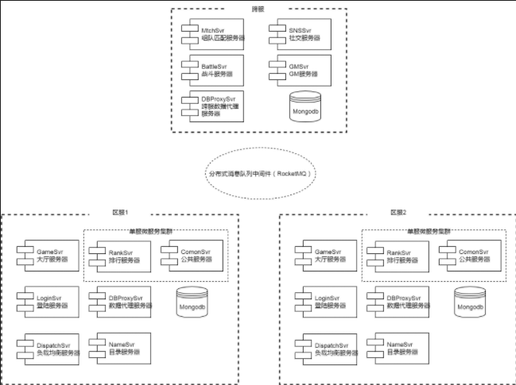

# 服务器架构概述

## 服务端架构大致内容

1. 从组件类型分类, 服务器由以下几种组件组成：

    * 一系列基于skynet框架的 **服务器** ：
        *LoginSvr, GameSvr, MatchSvr, RankSvr, DispatchSvr, DBProxySvr, TeamSvr, BattleSvr, NameSvr, GmSvr, ServerChooseSvr etc.*
    * 消息中间件: RocketMQ
    * 数据库: mongodb, redis
    * 分布式协调服务: Zookeeper(*不在图中*)
    * 负载均衡工具: Haproxy, keepalive(*不在图中*)

2. 各种基于skynet框架的服务器负责独立的功能 通过RocketMQ消息中间件 实现 **RPC框架**
3. 不同功能的服务器共同组成一个 **区服节点**
4. 通过 **Zookeeper** 提供区服节点的各个独立服务器高可用性
5. Haproxy主要对某些特定服务器提供 **负载均衡** 的作用

## 支持功能：

* [x] 基本包含了游戏服务器所需的基本组件 支持实现大部分游戏系统

## 需要补充的功能

* [ ] 高并发瓶颈压测
* [ ] 数据分库分表
* [ ] 热点数据容灾措施
* [ ] 持久化数据备份
* [ ] 合服支持
* [ ] 游戏管理后台
* [ ] 流量控制
