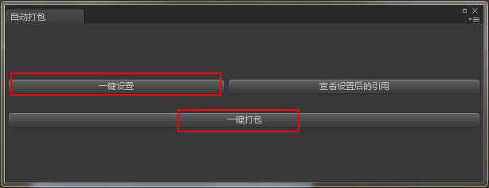
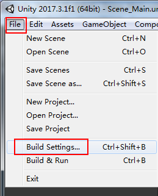

# develop error

```shell
2018-07-12 17:18:36::GMT[:00000000] rpc error[[MQClientAPIImpl.cpp:1289]|error: 2|msg:[TIMEOUT_CLEAN_QUEUE]broker busy, start flow control for a while, period in queue: 204ms, size of queue: 0]
2018-07-20 04:30:07::GMT[:00000000] rpc error[[MQClientAPIImpl.cpp:1289]|error: 2|msg:[REJECTREQUEST]system busy, start flow control for a while]
```

---

## 导表流程

### 1. 打开  [地址](http://192.168.3.18:8080/exportTableTool/)

    ```text
    账号 wangyida
    密码 wangyida
    ```

### 2. export lua

>* 选择版本


>* 确定


>* 导出业务相关的表数据


### 3. 在[目录](http://192.168.0.151:18082/svn/svn_CJ/design/数据表/trunk/config) 下点击下图批处理，即可导出战斗相关的表数据。


### 4. 导表生成的目录

> http://192.168.0.151:18082/svn/svn_CJ/program/client/config/trunk
---

## PC 打包流程

### 1．生成需要的美术资源

>* 打开美术工程，点击界面，


>* 弹出打包界面



>* 点击一键设置，等待设置完成，点击一键打包，即可。

### 2．更新客户端Svn路径，更新需要的客户端代码以及表数据。

> http://192.168.0.151:18082/svn/svn_CJ/program/client

### 3．如果直接运行编辑器，则直接点击运行即可看到效果。

### 4．如果需要打成PC端，则需要把

> http://192.168.0.151:18082/svn/svn_CJ/program/client/resbin/trunk 路径下的 windows文件夹 拷贝到

> http://192.168.0.151:18082/svn/svn_CJ/program/client/trunk/cj/Assets/StreamingAssets 这个目录，

并在编辑器下点击



弹出界面点击Build按钮即可生成可执行文件。

